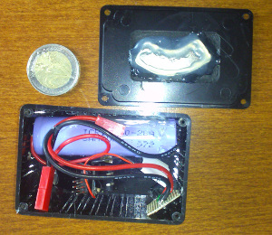
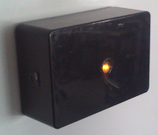
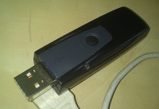

# esp8266-WifiScanMap

The aim of this project is to build autonomous device as small as possible.

Scan and map all 802.11 access point, stations probes and stations in order to fill the  [wifiScanMap](https://github.com/mehdilauters/wifiScanMap) database.

It scan over networks, stations, probes request and then synchronize to a central database through a json API through a known wifi spot (essid, password) or through dns tunneling on several open spots ( SFR WIFI FON ).

The central database compute the device position thanks to already known wifi access point.

Some tests were done on device shapes:
 - magnetic dropable blackbox (36 hour of autonomy)
 
   
   
 - usb powered device
 
   
 - solar totally autonomous box powered by battery + solar panels

This version was built on the Espressif sdk 1.2

To set up your config, please check files [user_config.h](user/user_config.h) and [wifis_spots.h](user/wifis_spots.h)

Please read the wifiScanMap [Readme](https://github.com/mehdilauters/wifiScanMap/blob/master/README.md) for more information